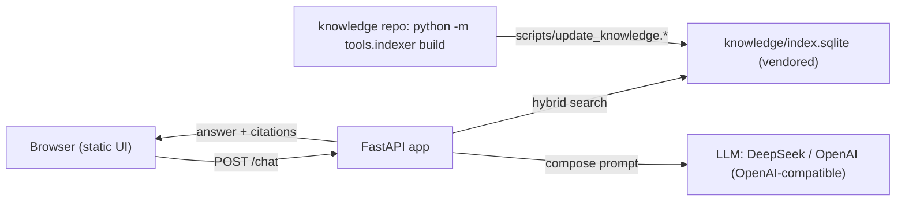

# ECG Knowledge Chatbot — Handoff & Maintenance Guide

**Source project:** this repo (`chatbot-web/`), a deployable FastAPI web app that answers questions about the Longitudinal ECG project with grounded, cited answers.
**Purpose:** Fully describe the chatbot web app so a future agent or maintainer can operate, extend, debug, or port it **without reading the knowledge repo** that produces the index.
**Standalone:** Every layout, contract, environment variable, and deploy step is embedded inline. Paths to the knowledge repo (`longitudinal_ecg`) are given for orientation only.

> Quick start for a fresh maintainer: read §3 (layout), §4 (how retrieval works), §8 (run locally), then §9 (deploy). When docs change upstream, see §10 (refresh) and §11 (vendor-sync).

---

## 1. What this is

A chat web app with a small static frontend. A user asks a question → the server runs **hybrid RAG** over a vendored SQLite index of the project's documentation → it calls an **LLM (DeepSeek or OpenAI)** server-side with an API key held in the server environment → it returns an answer with **citations** to specific files, sections, and line ranges (e.g. `Heart-Analysis-Approach/01-signal-pipeline.md §2.1 (L65-71)`).

Why a server (Render Web Service) and not a static site: the API key must never reach the browser, and retrieval runs against a SQLite index on the server. GitHub Pages cannot do either.

## 2. Architecture



Data flows one way: the knowledge repo is the source of truth; the chatbot only ever reads from it.

## 3. Repo layout

```
app/
├── main.py          FastAPI app (endpoints, lifespan index load, CORS)
├── chat.py          LLM proxy + prompt assembly (OpenAI-compatible)
├── retrieval.py     vendored hybrid retrieval (self-contained; see §11)
└── static/          chat UI: index.html, styles.css, app.js
knowledge/           vendored index: index.sqlite, chunks.jsonl, manifest.json
scripts/
├── update_knowledge.ps1   pull latest index from the knowledge repo (Windows)
└── update_knowledge.sh    same (bash)
render.yaml          Render Blueprint (Web Service)
requirements.txt     fastapi, uvicorn, openai
README.md            quick start
HANDOFF.md           this file
```

## 4. How retrieval works

`retrieval.py` is a **self-contained vendored copy** of the knowledge repo's `tools/indexer/{search.py, embed.py, store.py, citations.py}`. It has no runtime dependency on the knowledge repo.

- **Index load** (`Index.load`): reads `knowledge/index.sqlite` into memory — one `chunks` row per retrievable unit with provenance (`path`, `heading_path`, `section`, `kind`, `start_line`, `end_line`, `content`, `tags`) plus packed float32 embedding blobs.
- **Hybrid search** (`hybrid_search`): runs two channels and merges them with **reciprocal rank fusion** (`RRF_K=60`):
  - *Keyword*: SQLite FTS5 `bm25()` over `chunks_fts` — finds exact identifiers, thresholds, section numbers, filenames. Falls back to substring matching for rare terms.
  - *Semantic*: cosine similarity between the query embedding and stored chunk embeddings.
- **Embedding backend**: at query time `Embedder` uses `fastembed` (`BAAI/bge-small-en-v1.5`, 384-dim) if installed, else a deterministic local hashing embedder (512-dim). A **dimension guard** compares the query-vector length to the index's stored dimension and degrades to keyword-only if they differ — so a local-backend query against a fastembed-built index still answers, just without semantic matching.
- **Citations**: `to_citation()` emits `{id, path, section, heading_path, kind, start_line, end_line, excerpt, url, score}`. `url` is a GitHub blob link when `GITHUB_REPO` is set.

The index manifest (`knowledge/manifest.json`) records `schema_version`, `index_version`, the embedding backend + dim, and the git sha of the source build.

## 5. API reference

| Method | Path | Description |
|---|---|---|
| GET | `/health` | liveness: `{ok, chunks, dim, llm_configured, llm_model}` |
| GET | `/search?q=&k=` | raw hybrid retrieval, no LLM → `{query, citations}` |
| GET | `/doc/{path}` | full markdown of one document |
| GET | `/chunks?path=&section=` | chunk provenance for a doc (optionally one section) |
| GET | `/map` | navigation manifest (doc graph) |
| POST | `/chat` | `{query, history, k}` → `{answer, citations, query}` |
| GET | `/` | the chat UI |

### `/chat` flow
1. `Index.hybrid_search(query, k)` → top-k citation objects.
2. `compose_messages(query, history, citations)` → a system prompt (answer only from context; cite inline `[1]`, `[2]`, …; never invent thresholds/file names) + up to the last 10 user/assistant history messages + a user block embedding each citation as a numbered source with its excerpt.
3. `llm_chat(messages)` → OpenAI-compatible call.
4. Return `{answer, citations}`. The frontend renders inline `[n]` markers as clickable chips.

### Citation shape
```json
{
  "id": "Heart-Analysis-Approach/01-signal-pipeline.md::2.1::part0",
  "path": "Heart-Analysis-Approach/01-signal-pipeline.md",
  "section": "2.1",
  "heading_path": "01 — Signal Pipeline > 2. Signal Quality Index > 2.1 SQI components",
  "kind": "table",
  "start_line": 65, "end_line": 71,
  "excerpt": "Motion artifact: h10_acc_rms_mg > 180 mg -> poor ...",
  "url": "https://github.com/USER/REPO/blob/main/Heart-Analysis-Approach/01-signal-pipeline.md#L65-L71",
  "score": 0.0312
}
```

## 6. LLM provider config

DeepSeek and OpenAI both expose OpenAI-compatible APIs, so `chat.py` uses one thin client (`openai` package pointed at `LLM_BASE_URL`). Switching providers is a config change, not a code change.

| Var | Required | Default | Notes |
|---|---|---|---|
| `LLM_API_KEY` | yes | — | Never ship to the browser; set as a Render secret. |
| `LLM_BASE_URL` | no | `https://api.deepseek.com` | OpenAI: `https://api.openai.com/v1`. |
| `LLM_MODEL` | no | `deepseek-chat` | e.g. `gpt-4o-mini`, `deepseek-reasoner`. |
| `GITHUB_REPO` | no | `""` | `you/longitudinal_ecg` enables GitHub blob citation URLs. |
| `CORS_ORIGINS` | no | `*` | Comma-separated allowed origins. |
| `KNOWLEDGE_DB` | no | `knowledge/index.sqlite` | Override index location. |
| `EMBED_BACKEND` | no | `auto` | `auto`/`fastembed` use fastembed; `local` forces the hash embedder. |

`/chat` without `LLM_API_KEY` returns `503 {"detail": "LLM_API_KEY is not configured..."}`.

## 7. Run locally

```powershell
pip install -r requirements.txt
$env:LLM_API_KEY = "..."            # required for /chat; /search etc. work without it
uvicorn app.main:app --reload
```

Open http://127.0.0.1:8000. If fastembed is not installed, retrieval still works via the local hash embedder (keyword search unaffected; semantic matching weaker) — install with `pip install fastembed` for full semantic search.

## 8. Deploy on Render

1. Push this folder as its own git repo.
2. Render → **New → Web Service** (not Static Site) → connect the repo.
3. Build: `pip install -r requirements.txt`. Start: `uvicorn app.main:app --host 0.0.0.0 --port $PORT`.
4. Set env vars (secrets): `LLM_API_KEY` required; `LLM_BASE_URL`, `LLM_MODEL`, `GITHUB_REPO`, `CORS_ORIGINS` optional.
5. `render.yaml` (included) describes exactly this service and can create it from the blueprint.

## 9. Refreshing the index (one-way sync)

The knowledge repo (`longitudinal_ecg`) is the source of truth. It keeps
`knowledge/{index.sqlite, chunks.jsonl, manifest.json}` committed (its
pre-commit hook rebuilds them whenever docs change). This repo vendors a copy
of those three files.

**Primary path — automated (no manual copy-paste):**
`.github/workflows/sync-knowledge.yml` runs daily (and on demand via the
"Run workflow" button) and:

1. Downloads the three index files from
   `https://raw.githubusercontent.com/MicahHeneveld/longitudinal_ecg/main/knowledge/`.
2. Fails loudly if `manifest.json` `schema_version` changed — that means
   `app/retrieval.py` must be re-vendored first (§10).
3. Runs a smoke check that the index actually loads with the vendored
   retrieval (`app/retrieval.py`), catching schema drift like a renamed
   `chunk_id` column.
4. Commits and pushes back to `main` only when the index changed. Render
   auto-redeploys on push, so the deployed chatbot serves the fresh index.

No action is needed for routine doc updates: commit docs in `longitudinal_ecg`
(the pre-commit hook rebuilds the index), and the next scheduled run vendors
them. To update immediately, trigger the workflow manually.

**Manual fallback — one-off local refresh:**

```powershell
# knowledge repo: rebuild + commit the index
python -m tools.indexer build
git add knowledge && git commit

# chatbot repo: copy the three index files over
scripts/update_knowledge.ps1    # or ./scripts/update_knowledge.sh
```

The script copies `knowledge/{index.sqlite, chunks.jsonl, manifest.json}` from
`$KNOWLEDGE_REPO` (default `C:\longitudinal_ecg`) into `chatbot-web/knowledge/`.
Commit and push; Render redeploys. The chatbot never writes upstream.

**Access note:** the workflow's download step reads `longitudinal_ecg` from its
public `raw.githubusercontent.com` URL. If that repo goes private, set a
`LONGITUDINAL_ECG_PAT` secret and authenticate the download step with it.

## 10. Vendor-sync (when the schema changes)

`app/retrieval.py` is a copy of the knowledge repo's retrieval modules. When the knowledge repo changes the **chunk schema** or retrieval behavior:

1. Copy the updated modules from `tools/indexer/{search.py, embed.py, store.py, citations.py}` into `app/retrieval.py` (keep the single-file, no-`tools`-import shape).
2. Bump `SCHEMA_VERSION` if the SQLite layout changed; re-vendor `knowledge/` (§9).
3. Re-verify `/health` (chunks/dim) and one `/search` smoke query; re-run the eval if available.
4. The knowledge repo's `tools/server/` is the always-fresh reference; this repo's copy is the deployed one — keep them in sync deliberately.

## 11. Frontend behavior

- `app.js` keeps an in-memory `history` (client-side only, per session) sent with each `/chat` call.
- Assistant messages render inline `[n]` markers; citation chips link to GitHub blob URLs when `GITHUB_REPO` is set, otherwise they fetch `/doc/{path}` and open a plain-text preview.
- Suggestion chips are hard-coded example questions; edit `index.html` to change them.
- `Clear` resets the transcript (history is already ephemeral).

## 12. Troubleshooting

| Symptom | Cause / fix |
|---|---|
| `/chat` → 503 "LLM_API_KEY is not configured" | Env var missing. Check the Render secret / local env. |
| `/chat` 5xx from provider | Bad key, wrong `LLM_BASE_URL`, or model name. Check Render logs. |
| `/search` returns keyword-only quality | Embedding backend mismatch or fastembed unavailable. Install fastembed or rebuild the index with the matching backend. |
| Index seems stale | Re-vendor `knowledge/` (§9). Check `manifest.json` `git_sha`/`built_at`. |
| Frontend citation opens a blank preview | `GITHUB_REPO` unset; the fallback `/doc` renderer needs the doc path to exist in the index. |

## 13. Known limitations

- No reranker; RRF over BM25 + vectors is sufficient for the current corpus (~300 chunks). Add a cross-encoder if retrieval degrades as the repo grows.
- Multi-turn memory is per-request in-memory only; no persistence.
- `fastembed` downloads the model on first use (network required at that moment).
- The knowledge index is the single source of content; docs added to the knowledge repo don't appear here until §9 runs.

## 14. Extension ideas

- **MCP adapter (v3)**: wrap `Index.hybrid_search` in an MCP server so Cursor/Claude-style agents can consume the same retrieval. No redesign of `retrieval.py` needed.
- **Reranker**: slot a cross-encoder between retrieval and prompt assembly.
- **Persistent conversations**: store `history` server-side keyed by session id.
- **Streaming**: switch `POST /chat` to SSE and render tokens incrementally.
